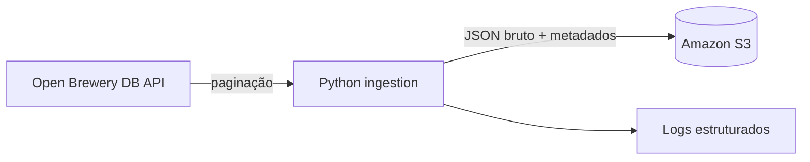

# Public API to S3 Landing Zone

Pipeline incremental que extrai dados paginados da [Open Brewery DB](https://www.openbrewerydb.org/), preserva a resposta bruta e a armazena no Amazon S3.

> 🧪 Projeto de portfólio com execução validada em AWS, usando uma fonte pública de dados.

## 🎯 Por que este projeto existe

Uma landing zone confiável preserva o dado de origem antes de qualquer transformação. Este projeto demonstra uma ingestão simples, reproduzível e segura para reprocessamento: cada página é gravada com uma chave determinística, evitando sobrescrever o mesmo lote no mesmo dia.

## 🏗️ Arquitetura



Os arquivos seguem o padrão:

```text
raw/open_brewery_db/ingested_date=YYYY-MM-DD/page=0001.json
```

## ✅ O que demonstra

- Consumo de uma API pública paginada, sem chave.
- Carga incremental e idempotente por data e página.
- Preservação de dados brutos em JSON, com metadados de origem.
- Logs de execução e tratamento explícito de falhas HTTP.
- Testes para paginação, chaves de armazenamento e reprocessamento.
- Infraestrutura mínima e versionada para S3 com Terraform.

## 💼 Onde essa arquitetura é útil

O exemplo usa uma API pública de cervejarias, mas o padrão se aplica a fontes externas que retornam dados em páginas e precisam ser preservadas antes de serem usadas por relatórios ou modelos.

| Cenário | Como a landing zone ajuda | Ganho prático |
| --- | --- | --- |
| Catálogo de e-commerce | Armazena respostas de produtos, preços e disponibilidade vindas de uma API de parceiro. | Mantém um histórico para investigar mudanças de preço, falhas de atualização ou divergências no catálogo. |
| Operação logística | Recebe lotes de pedidos, entregas ou rastreamento de uma plataforma terceirizada. | Permite reprocessar um dia específico sem pedir uma nova extração ao fornecedor. |
| Marketing e CRM | Coleta leads, campanhas ou métricas de canais de mídia. | Separa a coleta da modelagem analítica e preserva a resposta original quando regras de negócio mudam. |
| Dados públicos | Captura dados de portais governamentais, clima, câmbio ou indicadores em APIs. | Cria séries históricas próprias e rastreáveis, mesmo quando a fonte altera ou remove registros. |

## 🔎 Comparação com abordagens mais frágeis

Uma solução inicial recorrente é baixar um CSV manualmente ou executar um script que atualiza uma planilha ou tabela operacional diretamente. Esse caminho funciona para uma consulta pontual, mas perde força quando a frequência, o volume ou a necessidade de auditoria aumentam.

| Abordagem | Limitação | Como este projeto responde |
| --- | --- | --- |
| Download manual de CSV e substituição de arquivo | Não há rotina confiável, histórico de origem ou repetição previsível. | A coleta é automatizada e cada página é preservada com data e identificador. |
| Script que sobrescreve uma tabela final | Dificulta investigar erros e reprocessar dados sem afetar consumidores. | O JSON bruto é guardado antes de qualquer transformação; uma camada posterior pode ser refeita a partir dele. |
| Arquivo compartilhado como integração | Alterações manuais, concorrência e falta de metadados tornam o processo pouco auditável. | O S3 fornece objetos imutáveis por chave, metadados de origem e versionamento do bucket. |
| Reexecução sem controle de estado | Pode gerar arquivos ou registros duplicados. | A chave determinística e a checagem de existência tornam a carga idempotente no mesmo dia. |

Essa landing zone não substitui uma base analítica, um modelo dimensional ou uma ferramenta de BI. Ela cria uma camada de origem confiável sobre a qual essas etapas podem ser construídas com menos risco.

## 🧰 Stack

Python · Requests · Boto3 · Amazon S3 · Docker · Pytest · Terraform · GitHub Actions

## 📊 Resultados da validação

O fluxo foi executado em uma conta AWS de laboratório, com uma carga limitada a duas páginas da API.

- **100 registros** recebidos e gravados em **2 arquivos JSON** no S3;
- **2 testes automatizados** aprovados dentro do container Docker;
- uma segunda execução na mesma data gravou **0 arquivos** e ignorou as **2 páginas** já existentes;
- o bucket foi criado pelo Terraform com versionamento, criptografia SSE-S3 e bloqueio de acesso público.

Essa segunda execução é a evidência da idempotência da landing zone: reprocessar o mesmo lote não sobrescreve nem duplica arquivos.

## 🐳 Execução com Docker

O Docker é a forma padrão de executar este projeto. Você precisa apenas do Docker Desktop, de credenciais AWS e de um bucket S3 existente. A pasta `infra/` contém a infraestrutura de referência.

### Validação antes da primeira carga

1. Inicie o Docker Desktop e confirme que o daemon está disponível:

   ```bash
   docker info
   ```

2. Crie o arquivo local de configuração e informe o bucket:

   ```bash
   copy .env.example .env
   ```

   No `.env`, preencha `S3_BUCKET` e as credenciais temporárias ou de acesso da AWS que serão usadas no teste: `AWS_ACCESS_KEY_ID`, `AWS_SECRET_ACCESS_KEY` e, quando aplicável, `AWS_SESSION_TOKEN`. O arquivo é ignorado pelo Git.

3. Valide a identidade AWS a partir de um container:

   ```bash
   docker compose run --rm aws sts get-caller-identity
   ```

   O comando deve retornar a conta e o ARN da identidade usada. Só então prossiga para Terraform ou para a carga.

   O serviço usa a imagem oficial da AWS publicada no Amazon ECR Public.

4. Execute uma carga limitada para validar o fluxo:

   ```bash
   docker compose build
   docker compose run --rm pipeline --max-pages 2
   ```

Para executar a suíte de testes dentro do container:

```bash
docker compose run --rm test
```

O arquivo `.env` não é versionado. Se você usa perfil ou SSO da AWS, disponibilize as credenciais ao container no momento da execução; nunca as inclua na imagem ou no repositório.

## ☁️ Infraestrutura com Docker

O Terraform também é executado pelo Compose. Defina um nome globalmente único para o bucket e execute:

```bash
docker compose run --rm terraform -chdir=infra init
docker compose run --rm terraform -chdir=infra plan -var="bucket_name=seu-bucket-unico" -var="aws_region=us-east-2"
```

Depois de revisar o plano, a aplicação é feita com o mesmo comando, trocando `plan` por `apply`.

## ⚙️ Configuração

| Variável | Descrição | Padrão |
| --- | --- | --- |
| `S3_BUCKET` | Bucket de destino | obrigatório |
| `AWS_REGION` | Região AWS | `us-east-1` |
| `S3_ENDPOINT_URL` | Endpoint S3 compatível para testes locais | vazio, usa AWS |
| `API_BASE_URL` | Endpoint da API | Open Brewery DB |
| `PER_PAGE` | Itens por página | `50` |
| `MAX_PAGES` | Limite opcional de páginas | sem limite |

## 🔗 Publicação e referências

Este projeto faz parte do laboratório de engenharia de dados de Bruno Martins. A publicação inclui este repositório, uma postagem resumida no LinkedIn e a [nota técnica sobre a landing zone](https://brunomartins94.github.io/notas/api-s3-landing-zone/) com decisões, trade-offs e aprendizados.
