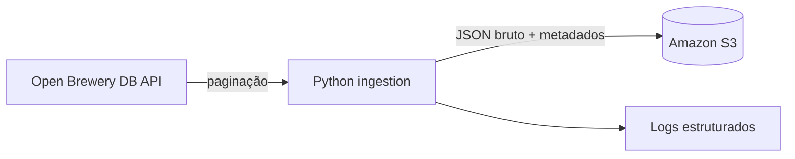

# Public API to S3 Landing Zone

Pipeline incremental que extrai dados paginados da [Open Brewery DB](https://www.openbrewerydb.org/), preserva a resposta bruta e a armazena no Amazon S3.

## Por que este projeto existe

Uma landing zone confiável preserva o dado de origem antes de qualquer transformação. Este projeto demonstra uma ingestão simples, reproduzível e segura para reprocessamento: cada página é gravada com uma chave determinística, evitando sobrescrever o mesmo lote no mesmo dia.

## Arquitetura



Os arquivos seguem o padrão:

```text
raw/open_brewery_db/ingested_date=YYYY-MM-DD/page=0001.json
```

## O que demonstra

- Consumo de uma API pública paginada, sem chave.
- Carga incremental e idempotente por data e página.
- Preservação de dados brutos em JSON, com metadados de origem.
- Logs de execução e tratamento explícito de falhas HTTP.
- Testes para paginação, chaves de armazenamento e reprocessamento.
- Infraestrutura mínima e versionada para S3 com Terraform.

## Stack

Python · Requests · Boto3 · Amazon S3 · Docker · Pytest · Terraform · GitHub Actions

## Execução com Docker

O Docker é a forma padrão de executar este projeto. Você precisa apenas do Docker Desktop, de credenciais AWS e de um bucket S3 existente. A pasta `infra/` contém a infraestrutura de referência.

### Validação antes da primeira carga

1. Inicie o Docker Desktop e confirme que o daemon está disponível:

   ```bash
   docker info
   ```

2. Crie o arquivo local de configuração e informe o bucket:

   ```bash
   copy .env.example .env
   ```

   No `.env`, preencha `S3_BUCKET` e as credenciais temporárias ou de acesso da AWS que serão usadas no teste: `AWS_ACCESS_KEY_ID`, `AWS_SECRET_ACCESS_KEY` e, quando aplicável, `AWS_SESSION_TOKEN`. O arquivo é ignorado pelo Git.

3. Valide a identidade AWS a partir de um container:

   ```bash
   docker compose run --rm aws sts get-caller-identity
   ```

   O comando deve retornar a conta e o ARN da identidade usada. Só então prossiga para Terraform ou para a carga.

   O serviço usa a imagem oficial da AWS publicada no Amazon ECR Public.

```bash
copy .env.example .env
docker compose build
docker compose run --rm pipeline --max-pages 2
```

Para executar a suíte de testes dentro do container:

```bash
docker compose run --rm test
```

O arquivo `.env` não é versionado. Se você usa perfil ou SSO da AWS, disponibilize as credenciais ao container no momento da execução; nunca as inclua na imagem ou no repositório.

## Infraestrutura com Docker

O Terraform também é executado pelo Compose. Defina um nome globalmente único para o bucket e execute:

```bash
docker compose run --rm terraform -chdir=infra init
docker compose run --rm terraform -chdir=infra plan -var="bucket_name=seu-bucket-unico"
```

Depois de revisar o plano, a aplicação é feita com o mesmo comando, trocando `plan` por `apply`.

## Configuração

| Variável | Descrição | Padrão |
| --- | --- | --- |
| `S3_BUCKET` | Bucket de destino | obrigatório |
| `AWS_REGION` | Região AWS | `us-east-1` |
| `S3_ENDPOINT_URL` | Endpoint S3 compatível para testes locais | vazio, usa AWS |
| `API_BASE_URL` | Endpoint da API | Open Brewery DB |
| `PER_PAGE` | Itens por página | `50` |
| `MAX_PAGES` | Limite opcional de páginas | sem limite |

## Critério de conclusão

Este projeto será concluído com repositório público, README finalizado, postagem no LinkedIn e artigo técnico no blog explicando decisões, trade-offs e aprendizados.
